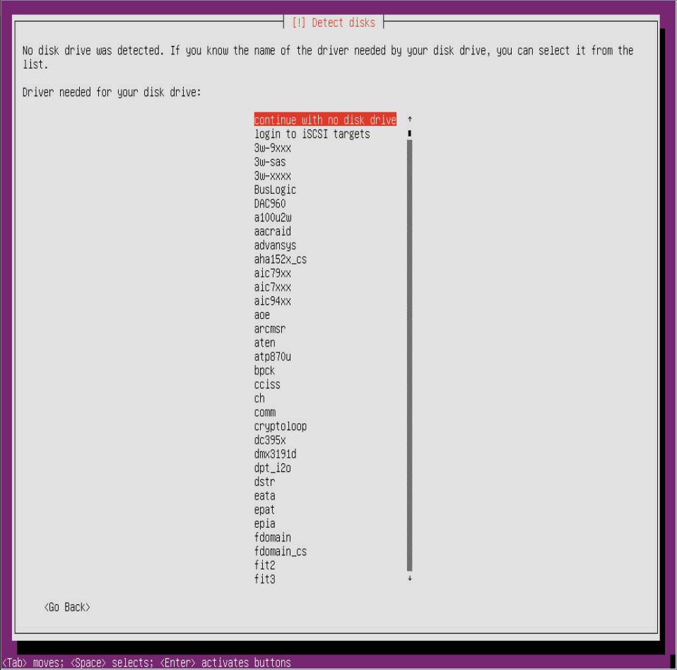
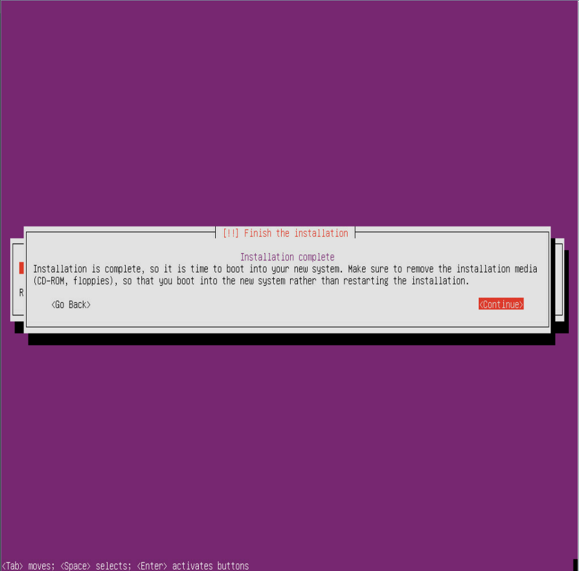

## 打驱动主要有三个步骤

> 提取KO文件 --> 加载驱动模块 --> 安装驱动到系统

- 提取KO文件
  
  - 安装对应的操作系统
  - 进入系统设置apt源及代理
  - 安装dkms，然后安装驱动
  - 提取ko文件
> <small> ko文件一般在/lib/modules/$(uname -r)/updates/dkms 目录下，可通过scp将其传到外部主机(外部主机需安装openssh-server) </small>

- 加载驱动模块
  - 安装系统至出现下图所示界面时，通过Ctrl+F2进入命令行界面，挂载提取的ko文件,可能需要通过KVM软件上方菜单中的软键盘。

    

    

  - 执行如下命令    
    
    `modprobe scsi_transport_sas`
    `modprobe raid_class`
    `modprobe configfs`
    `insmod  megarai_sas.ko` 
  > <small>最后一条命令需注意ko文件的位置</small>
> <small>执行完此操作后Ctrl+F1返回安装界面，然后选择正确的驱动名称可能就可以安装系统了</small>
  
-  特别注意： 当出现下图界面切记 **不要点击**  `Continue` 
  
- 安装驱动到系统

  - Ctrl+F2进入命令行

  - 执行如下命令

    `chroot /target/`

    `bash`

  - 将驱动文件通过挂载或ssh传到服务器

  - 配置apt源、代理，安装dkms及驱动

  - 安装成功后Ctrl+F1返回安装界面并点击`Continue`重启

> 参考教程 https://blog.csdn.net/womenrendeme/article/details/110914078 

